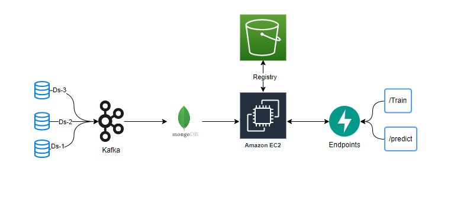

# APS SENSOR FAULT DETECTION

### PROBLEM STATEMENT

The Air Pressure System (APS) is a critical component of a heavy-duty vehicle that uses compressed air to force a piston to provide pressure to the brake pads, slowing the vehicle down. The benefits of using an APS instead of a hydraulic system are the easy availability and long-term sustainability of natural air.

This is a Binary Classification problem, in which the affirmative class indicates that the failure was caused by a certain component of the APS, while the negative class
indicates that the failure was caused by something else.

### SOLUTION

In this project, the system in focus is the Air Pressure system (APS) which generates pressurized air that are utilized in various functions in a truck, such as braking and gear changes. The datasets positive class corresponds to component failures for a specific component of the APS system. The negative class corresponds to trucks with failures for components not related to the APS system.

The problem is to reduce the cost due to unnecessary repairs. So it is required to minimize the false predictions.

### TECH STACK

1. Python
3. ML algos
4. FastAPI
5. Docker
6. MongoDB

### INFRASTRUCTURE

1. AWS S3
2. AWS EC2
3. AWS ECR
4. Git Actions
5. Terraform 

### ENV SETUP

```bash
conda create -p ./env python=3.8 -y
source activate ./env
pip install -r requirements.txt
python setup.py install # to build a library
```

### ENV VARIABLES

Setup environment variables in local system 

AWS IAM full S3, EC2, ECR access

```python
import os
db_url = os.getenv('MONGO_DB_URL', None)
aws_access_key = os.getenv('AWS_ACCESS_KEY', None)
aws_access_secret = os.getenv('AWS_ACCESS_SECRET', None)
aws_region = os.getenv('AWS_REGION', None)
```

### DATA COLLECTION


### PROJECT STRUCTURE


### DEPLOYMENT ARCHIETECTURE


### RUN APPLICATION

```bash
python app.py
```

### TRAIN MODEL

```bash
http://localhost:8080/train
```

### PREDICTION

```bash
http://localhost:8080/predict
```

